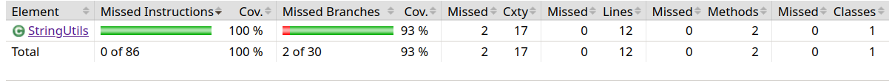
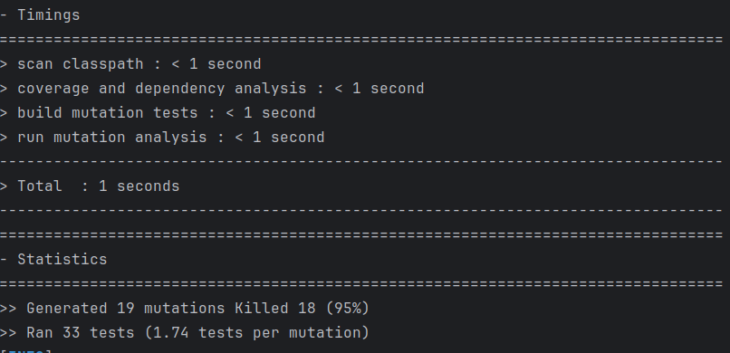

# Balanced strings

A string containing grouping symbols `{}[]()` is said to be balanced if every open symbol `{[(` has a matching closed symbol `)]}` and the substrings before, after and between each pair of symbols is also balanced. The empty string is considered as balanced.

For example: `{[][]}({})` is balanced, while `][`, `([)]`, `{`, `{(}{}` are not.

Implement the following method:

```java
public static boolean isBalanced(String str) {
    ...
}
```

`isBalanced` returns `true` if `str` is balanced according to the rules explained above. Otherwise, it returns `false`.

Use the coverage criteria studied in classes as follows:

1. Use input space partitioning to design an initial set of inputs. Explain below the characteristics and partition blocks you identified.
2. Evaluate the statement coverage of the test cases designed in the previous step. If needed, add new test cases to increase the coverage. Describe below what you did in this step.
3. If you have in your code any predicate that uses more than two boolean operators, check if the test cases written so far satisfy *Base Choice Coverage*. If needed, add new test cases. Describe below how you evaluated the logic coverage and the new test cases you added.
4. Use PIT to evaluate the test suite you have so far. Describe below the mutation score and the live mutants. Add new test cases or refactor the existing ones to achieve a high mutation score.

Write below the actions you took on each step and the results you obtained.
Use the project in [tp3-balanced-strings](../code/tp3-balanced-strings) to complete this exercise.

## Answer

| Caractéristique           | Partition                                     | Explication                                        |
|---------------------------|-----------------------------------------------|----------------------------------------------------|
| Chaîne Vide               | `""`                                          | Tester avec une chaîne vide pour assurer la correction.|
| Parenthèses Équilibrées   | `"{}"`, `"[()]"`, `"{[()]}"`, `"((()))"`     | Tester différentes combinaisons de parenthèses équilibrées.|
| Parenthèses Non Équilibrées| `"{[}"`, `"(())]"`, `"(()))"`                | Tester différentes combinaisons de parenthèses non équilibrées.|
| Parenthèses Mélangées     | `"{[()]}", "([)]"`                           | Tester des expressions avec des parenthèses mélangées.|
| Autres Caractères         | `"abc"`, `"123"`, `"abc(def)123"`             | Inclure des caractères alphanumériques et des symboles.|
| Parenthèses Emboîtées      | `"({})"`, `"{[()]}"`, `"((()))"`             | Tester avec des expressions contenant des parenthèses emboîtées.|

2. On remarque que nous avons réalisé un ensemble de 17 tests, chacun évaluant une des caractéristiques du tableau ci-dessus. Il est à noter que, parfois, pour une même caractéristique, plusieurs tests sont réalisés (par exemple, pour tester de nouvelles combinaisons). Nous avons ainsi couvert toutes les caractéristiques identifiées, ce qui nous permet de considérer avoir une couverture élevée. En ajoutant Jacoco pour l'évaluation, on observe un taux de couverture de 93 %.

3. On remarque qu'à trois reprises, nous avons plus de deux booléens dans un if statement. Néanmoins, il est important de noter que ces lignes ont bien été testées. Ainsi, nous n'avons pas besoin de les tester davantage.
4.  On constate ici la création de 33 tests, dont 19 concernent des mutations. Sur ces 19 mutations, 18 ont été éliminées avec succès, atteignant ainsi un taux de 95 %. C'est un résultat très positif. Cependant, il est à noter que nous n'avons pas réussi à améliorer davantage ce score.
 
